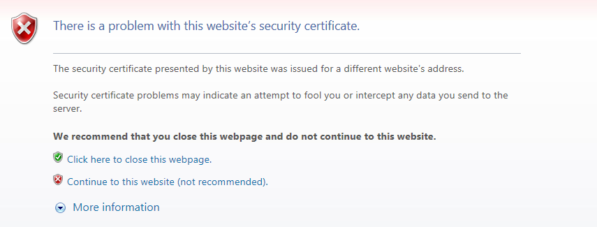

.. _https:

Chapter 9. HTTPS
******************

This chapter will explain how to configure HTTPS. STON supports up to TLS 1.2, but allows SSL 2.0 only for upgrades due to security reasons. HTTPS is used only between the client and STON. STON does not communicate with the origin server using HTTPS, because it wouldn't be suitable for security and performance reasons if STON used HTTPS as a relay. If the origin server must use HTTPS to communicate, using :ref:`bypass-port` is recommended.

.. toctree::
   :maxdepth: 2

Service Configuration
====================================

As long as a specific IP or port is not designated, the default binding service address is "\*.443". This is configured in the global configuration (server.xml). ::

   # server.xml - <Server>

   <Https>
      <Cert>/usr/ssl/cert.pem</Cert>
      <Key>/usr/ssl/certkey.pem</Key>
      <CA>/usr/ssl/CA.pem</CA>
   </Https>
    
   <Https Listen="1.1.1.1:443">
      <Cert>/usr/ssl_ip_port/cert.pem</Cert>
      <Key>/usr/ssl_ip_port/certkey.pem</Key>
      <CA>/usr/ssl_ip_port/CA.pem</CA>
   </Https>
    
   <Https Listen="*:886">
      <Cert>/usr/ssl_port/cert.pem</Cert>
      <Key>/usr/ssl_port/certkey.pem</Key>
      <CA>/usr/ssl_port/CA.pem</CA>
   </Https>   
   
-  ``<Https>`` Configures HTTPS.
   
   -  ``<Cert>`` Server certificate.
   
   -  ``<Key>`` The private key for server certification. Encrypted formatting not supported. 
   
   -  ``<CA>`` Certificate authority (CA) chain certificate. 
  
Even if the same port is used, more specific expressions will take priority.

For example, if there are multiple NICs as in the example above, a client that connects using 1.1.1.1:443 will be given service using the second and more specific certificate (1.1.1.1:443), while a client that connects to 1.1.1.4:443 will be given service with the first and more general certificate (omitted, or \*:443). If the certificate is overwritten with a file of the same name, the changes will be reflected upon reload.

.. note::

   Only the PEM (Privacy Enhanced Mail) format is supported for certificates, and RSA for the asymmetric key algorithm.

.. _https-aes-ni:

SSL/TLS Acceleration
====================================

SSL/TLS can be accelerated using CPU (AES-NI). A CPU that supports AES-NI will prioritize the AES algorithm for SSL/TLS. If AES-NI is recognized, the following will be recorded in the Info.log file. ::

   AES-NI : ON (SSL/TLS accelerated)
   
Administrators can select whether to use AES-NI or not. ::

   # server.xml - <Server><Cache>

   <AES-NI>ON</AES-NI>   

-  ``<AES-NI> (default: ON)`` Decides whether or not AES-NI is used.

.. _https-ciphersuite:

CipherSuite Selection
====================================

The following CipherSuites are supported.

================================================ ======== =========== ======= 
Cipher Suite                                     TLS1.2   TLS1.1/1.0  SSL3.0
================================================ ======== =========== =======
TLS_ECDHE_RSA_WITH_AES_128_GCM_SHA256	(0xc02F)   O       
TLS_ECDHE_RSA_WITH_AES_128_CBC_SHA256	(0xC027)   O
TLS_ECDHE_RSA_WITH_AES_256_CBC_SHA (0xC014)      O        O
TLS_ECDHE_RSA_WITH_AES_128_CBC_SHA (0xC013)      O        O
TLS_RSA_WITH_AES_128_GCM_SHA256	(0x009C)         O
TLS_RSA_WITH_AES_256_CBC_SHA256	(0x003D)         O
TLS_RSA_WITH_AES_128_CBC_SHA256	(0x003C)         O
TLS_RSA_WITH_AES_256_CBC_SHA (0x0035)            O        O
TLS_RSA_WITH_AES_128_CBC_SHA (0x002F)            O        O
TLS_RSA_WITH_3DES_EDE_CBC_SHA (0x000A)           O        O
TLS_RSA_WITH_RC4_128_SHA (0x0005)                                     O
TLS_RSA_WITH_RC4_128_MD5 (0x0004)                                     O
================================================ ======== =========== =======

The CipherSuite to be used can be configured in the ``CipherSuite`` property of ``<Https>``. ::

   # server.xml - <Server>

   <Https CipherSuite="ALL:!ADH:RC4+RSA:+HIGH:+MEDIUM:+LOW:+SSLv2:+EXP">
      <Cert>/usr/ssl/cert.pem</Cert>
      <Key>/usr/ssl/certkey.pem</Key>
      <CA>/usr/ssl/CA.pem</CA>
   </Https>   

-  ``CipherSuite`` Follows the `SSLCipherSuite Directive in Apache mod_ssl <http://httpd.apache.org/docs/2.2/mod/mod_ssl.html#sslciphersuite>`_.

A higher level of security can be obtained by ensuring `forward secrecy <https://en.wikipedia.org/wiki/Forward_secrecy>`_ (refer to links below).

   - `SSL Labs: Deploying Forward Secrecy <https://community.qualys.com/blogs/securitylabs/2013/06/25/ssl-labs-deploying-forward-secrecy>`_
   - `SSL/TLS & Perfect Forward Secrecy <http://vincent.bernat.im/en/blog/2011-ssl-perfect-forward-secrecy.html>`_   
   - `Configuring Apache, Nginx, and OpenSSL for Forward Secrecy <https://community.qualys.com/blogs/securitylabs/2013/08/05/configuring-apache-nginx-and-openssl-for-forward-secrecy>`_

By default, a CipherSuite that ensures forward secrecy (FS) is prioritized. ::

   # server.xml - <Server>

   <Https FS="ON"> ...  </Https>

-  ``FS``

   - ``ON (default)`` A CipherSuite that ensures forward secrecy is prioritized.
   - ``OFF`` Selects in the order specified by ClientHello.
   
The ``FS`` property takes priority over the ``CipherSuite`` property.

.. note::

   Due to performance reasons, only ECDHE is supported. DHE is not supported.

.. _https-ciphersuite-query:

Checking the CipherSuite
====================================

The results of configuring the CipherSuite can be checked. CipherSuite expression follows `OpenSSL 1.0.0E <https://www.openssl.org/docs/apps/ciphers.html>`_. ::

   http://127.0.0.1:10040/monitoring/ssl?ciphersuite=...

The results are returned in JSON format. ::

  {
      "version": "2.0.0",
      "method": "ssl",
      "status": "OK",
      "result":
      [
          {
              "Name" : "AES128-SHA", 
              "Ver" : "SSLv3", 
              "Kx" : "RSA", 
              "Au" : "RSA", 
              "Enc" : "AES(128)", 
              "Mac" : "SHA1"
          },
          {
              "Name" : "AES256-SHA", 
              "Ver" : "SSLv3", 
              "Kx" : "RSA", 
              "Au" : "RSA", 
              "Enc" : "AES(256)", 
              "Mac" : "SHA1"
          }
      ]
  }

Multi-Domain Configuration
====================================

SSL configurations can cause problems when a single server runs multiple services simultaneously. Most Web/Cache servers decide which virtual host is used for the service by examining the Host header of the HTTP request.

      
   General HTTPS communication.
   
Generally, the SSL identifies the server name (winesoft.co.kr) that the client (browser) tries to connect to using the certificate. However, if identification cannot be done with the certificate (e.g. the certificate is wrong or expired), then the user will be asked whether to trust the website or not (though there are cases when the site is blocked entirely). Though normal identification could not be done, SSL communication can still be established with the client's trust.

      
   It is left to the client to judge.
   
If there is only one virtual host on the server that uses SSL, no problems will occur. However, multiple virtual hosts running simultaneously on a server can cause problems. This is because when the server sends the certificate to the client ("2. Certificate Transmission" in "General HTTPS communication"), the server is unable to know which host the client is trying to reach.

The following show some typical solutions for this issue.

=================== =================================================== =====================================================================
Method              Pros                                                Cons
=================== =================================================== =====================================================================
SNI                 Works with only server settings (standard)          Windows XP and IE6 unsupported
Multi Certificate   Works by replacing only the certificate             Main domain or service subject must be the same for faster reissuing
Multi Port          Works by changing only the port                     HTTPS port must be specified on the web page
Multi NIC           Works with only server settings (most widely used)  Configuration of NIC and IP adding required
=================== =================================================== =====================================================================

SNI (Server Name Indication)
----------------------------

This method makes use of the `SNI (Server Name Indication) <http://en.wikipedia.org/wiki/Server_Name_Indication>`_ expansion field of SSL/TLS. This function is used by specifying the target virtual host like the Host header of an HTTP request when the client requests an SSL connection from the server. Though this is the most elegant solution, there can be some compatibility issues. The following lists the clients that do not support SNI (source: `Wikipedia - Server Name Indication <http://en.wikipedia.org/wiki/Server_Name_Indication#Client_side>`_ ).

- Internet Explorer (any version) on Windows XP or Internet Explorer 6 or earlier
- Safari on Windows XP
- BlackBerry Browser
- Windows Mobile up to 6.5
- Android default browser on Android 2.x[34] (Fixed in Honeycomb for tablets and Ice Cream Sandwich for phones)
- wget before 1.14
- Java before 1.7

Realistically, SNI cannot be used, and STON does not support SNI.

Multi Certificate
--------------------------

This method places multiple domains or wildcards (i.e. \*.winesoft.co.kr) in the certificate so that multiple domains can be identified with only one certificate.

.. figure:: img/faq_ssl2.jpg
   :align: center
      
   Multiple domains can be certified with one certificate.
   
This method is effective if the subjects of the service are the same, but if there is no relation, sharing the certificate is rather difficult. As this method can be used just by replacing the certificate, there is no need to configure anything in STON (see also `DigiCert <http://www.digicert.com/wildcard-ssl-certificates.htm>`_ ).

Multi Port
--------------------------

SSL uses port 443 by default. By setting up a port that does not overlap with the SSL port, multiple certificates can be installed. The port can be specified on the client to request an SSL connection. ::

    https://winesoft.co.kr:543/
    
Multiple certificates can be set up in STON by specifying the ports in the Listen property, as shown below. ::

   # server.xml - <Server>

   <Https> ..Certificate A.. </Https>  
   <Https Listen="*:543"> ..Certificate B.. </Https>  
   <Https Listen="*:544"> ..Certificate C.. </Https>
    
Though this is the most economical solution, there is the problem of having to specify the HTTPS port on all webpage links.

Multi NIC
--------------------------

If the server has multiple NICs, a different IP can be assigned to each NIC. A different certificate will be installed for each server IP, and STON will be configured to choose the certificate based on the IP accessed by the client.  In STON, the IP can be specified in the Listen property to allow multiple certificates to be configured. ::

   # server.xml - <Server>

   <Https Listen="10.10.10.10"> ..Certificate A.. </Https>  
   <Https Listen="10.10.10.11"> ..Certificate B.. </Https>  
   <Https Listen="10.10.10.12"> ..Certificate C.. </Https>

This method is the most widely used.

.. note::

   If configurations are made public, problems can be caused by knowledge of IP addresses. In this case, NIC names can be used in place of IPs. ::

      # server.xml - <Server>

      <Https Listen="eth0"> ... </Https>  
      <Https Listen="eth1"> ... </Https>  
      <Https Listen="eth2"> ... </Https>

Enabling Security Protocol
====================================

The protocol can be established for each ``<Https>``. ::

   # server.xml - <Server>

   <Https TLS1.2="ON" TLS1.1="ON" TLS1.0="ON" SSL3.0="ON"> ...  </Https>

- ``TLS1.2 (default: ON)`` Uses TLS1.2.

- ``TLS1.1 (default: ON)`` Uses TLS1.1.
   
- ``TLS1.0 (default: ON)`` Uses TLS1.0.

- ``SSL3.0 (default: ON)`` Uses SSL3.0.

.. _https-hsts:

HSTS
====================================

`HSTS (HTTP Strict Transport Security) <https://en.wikipedia.org/wiki/HTTP_Strict_Transport_Security>`_ can be easily set up using :ref:`handling_http_requests_modify_client`.
::

   # /svc/www.example.com/headers.txt
   
   *, $RES[Strict-Transport-Security: max-age=31536000; includeSubDomains], set

The `Qualys SSL Server Test <https://www.ssllabs.com/ssltest/>`_ only returns an A+ rating for sites with HSTS enabled.

.. figure:: img/qualys_a_plus.png
   :align: center
      
   STON can receive A+s starting from v2.2.
