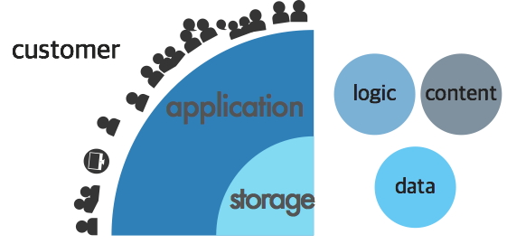
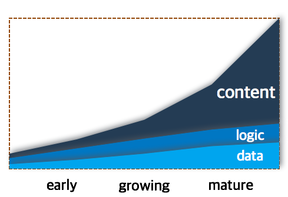
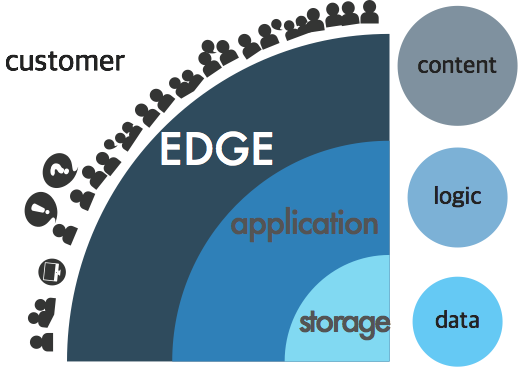
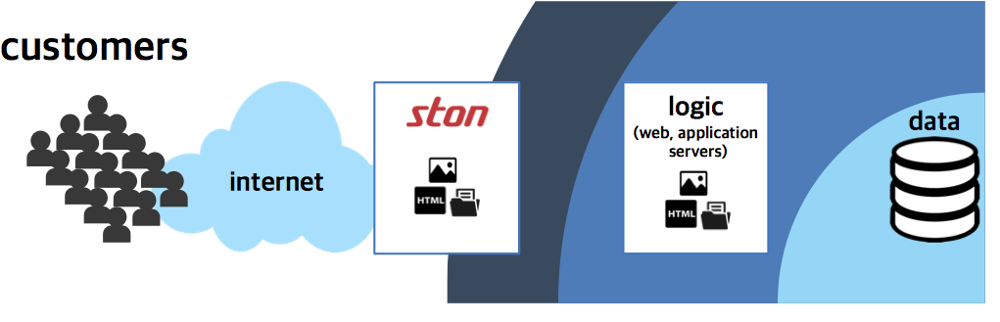
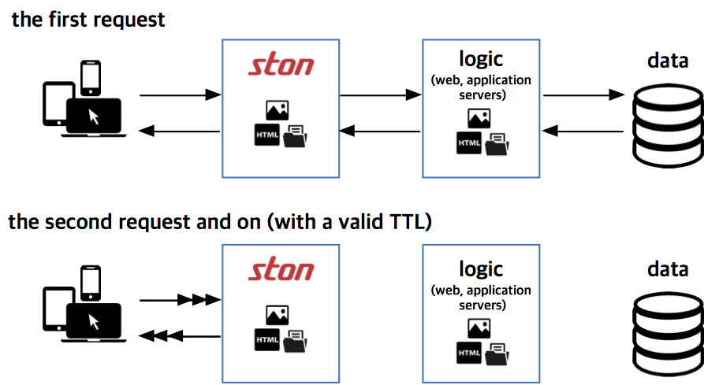

.. _intro:

Chapter 1. STON Edge Server
**********************************

.. toctree::
   :maxdepth: 2

Principles of Service Design
============================
The success of a service depends on availability, speed, and scalability. Kate Matsudaira, author of "Building Scalable Web Architecture and Distributed Systems", also emphasized these three principles.

**Availability**

A service must always be available. In the event of failure, ninety percent of users will move on to competitors. While there is no such thing as a perfect system, recovering from failures must be quick.

**Speed**

In business, time is money, and in e-commerce, high latency will lead to a drop in sales. For every 0.1 second of latency, there is a one percent decrease in revenue. 47 percent of Amazon.com customers want a website loaded on their screen within two seconds.

**Scalability**

Regardless of the number of users, the service must always be reliable. Scalability is the effort required to increase the system's capacity to handle more load, and can also refer to how easy it is to add more storage or how many more transactions can be processed. Scalability in maintenance is also important: it should be easy to diagnose and understand problems and implement updates or fixes.

The service is most effective when all the principles can be upheld at the smallest possible cost. Cost is not limited to just money, but also includes time, effort, and training. 

A successful service must **grow**, and when it does, it must be able to manage more clients and more content. However, as the system grows, it becomes harder to uphold these principles. What can be done to uphold these principles at the smallest possible cost?

The Growth of the Service
=========================

A test or pilot service generally begins with one or two servers, and when it begins to grow, the number of servers will increase accordingly. Content renewal must be meticulously carried out one server at a time. It may be a laborious task, but it is not an impossible one as of yet.

As the service begins to expand with more users and more accumulated data, managing each server one by one becomes even more difficult. At this point, high-cost storage (e.g. NAS, SAN, DAS) is introduced to collect all the data in one system. Expensive but reliable storage systems make content renewal easier, because servers can automatically acquire updated content from storage.

However, as the service sharply grows, the number of servers increases. More servers mean more data from storage, leading to data transfer overload. A new storage system that supports higher bandwidth can be even more expensive, so it's questionable if one would want to invest in it.

A potential solution to the problem is synchronization. Getting all the data ready is impractical, so the storage system must be able to sort the content. Management is essential to achieve precise content control. Synchronization across a few servers may be easy, but the more servers and files to sync, the harder it becomes. Synchronization can become slower, harder, and even more unstable as the system expands.

Moreover, content is constantly changing. The more files there are to add or delete, the longer the synchronization time becomes. A larger-scale service inevitably requires a bigger and more complicated synchronization managing system. Any problems in the management system may eventually lead to total service failure.

A simpler method to quickly and flexibly deliver content to servers is necessary.


.. _intro_service_scaling:

Service Scalability and Content Delivery
========================================

As shown in the figure below, a service can be broken down into two layers.

      
In the center is the storage layer, which manages data. Above it is the application layer, which implements the service logic and can also process content delivery for a small number of customers. In the beginning stages, the service can be set up with only the storage and application layers.

As the service grows, the total cost will change. In the beginning stages, the biggest expense is in logic development, while in the growth stages, the biggest expense is in data management in accordance with the number of users. However, as the service matures, the main concern becomes **content delivery**, making it a huge hurdle for service expansion. How can the exploding bandwidth be taken care of?

The Edge: The Delivery Layer
============================

   
When the service reaches maturity, the burden of content delivery will increase exponentially. Shopping mall content numbers in the billions, and the video service content has long since begun to use terabytes. To expand a service, the **scalability of content delivery** must definitely be taken into account. 

The edge layer is the outermost layer of the service in which clients will be able to experience speed and availability. No matter the circumstances, the content requested by the users must always be delivered to them. Broken images or unavailable pages on the user's screen is fatal to the reputation of the service.  By handling content delivery via the edge, there is less of a burden on the application and storage layers.

Having an easily and efficiently expandable edge layer removes the need to expand other high-cost layers. Meanwhile, expanding the storage layer or the application layer is a poor choice due to its high cost and low efficiency.

In that case, how does the STON Edge Server make content delivery quicker and easier?

The Behavior of the Edge Server: Caching
========================================

The scale of data delivery is proportional to the number of users and the size of content. The service can detect how many users are requesting what content most quickly within the edge layer. Because the bottom-up workflow from edge layer is the most efficient, the edge server implements **caching** behavior that responds on demand to the users' requests, without any need for management systems. The procedure is as follows.

   
When the edge server receives its first content delivery request, it obtains the content from the storage layer and then transfers the content to the user. This transferred content is also saved in the edge server itself. On future requests, the saved content can immediately be delivered to the users from the edge server itself. The saved content will only be available during the preset Time To Live (TTL) period.

In this way, the edge server can handle a considerable amount of content. It can allow for quick mass distribution of data while minimizing the need to expand the application and storage layers. Any growing service should take the edge server into consideration.

The STON Edge Server is software that aims to provide an unrestricted and unconditional environment. The server is designed to provide maximum performance on any type of hardware platform.

**CPU:** Optimized for multi-core processors. Throughput is proportional to the number of CPU cores.

**Memory:** Larger memory allows for faster processing and cuts down on Disk I/O.

**Disk:** I/O is evenly distributed to cache more data.

**NIC:** Guaranteed bandwidth of either 4 Gbps NIC Bonding or 10 Gbps NIC.

The STON Edge Server supports **powerful live monitoring and logging**. The administrator can check the current service status in real time with statistics updated every second. The real-time statistics are offered in universal formats such as JSON, XML, and SNMP.

STON offers **simple installation** for the sake of administrators, because STON's design principle is to be an edge server made with administrators in mind. An intuitive installation method is provided via the Web Management page. More detailed settings can be configured by editing only two XML files.

Benefits of the Edge Server
===========================
The benefits of the edge server are listed below.

- Provides simple and convenient service acceleration
- Shields the service origin from external access (Origin Shielding)
- Allows the other layers to concentrate on their fundamental roles

The advantages of adopting the edge server can be seen in the following application examples.

Gaming
----------------------------

Gaming services require a large amount of bandwidth. There are a variety of categories in gaming, from "masterpiece" games to casual games. Smartphone games have become especially popular, further diversifying the forms of services.

.. figure:: img/icons_game.png
   :align: center

-  **High Bandwidth Throughput**
  
    A universal method to acquire high bandwidth with a single server is bonding 1 Gbps NIC (Network Interface Controller). With this, up to 4 Gbps can be achieved. Recently, 10Gbps NICs have also become common.

    ``STON`` guarantees full bandwidth for both 4 Gbps NIC Bonding and 10 Gbps NIC.
  
-  **Max User Bandwidth Guaranteed**

    Everyone wants to play games as soon as possible, so they will want to download their games as fast as possible. Users with fiber optic LAN may complain if their speed falls under 100 Mbps. As long as a server's bandwidth isn't physically exceeded, it must be able to guarantee maximum speed equally to every user.
  
    ``STON`` guarantees maximum transmission speed to all users.
  
-  **Processing Large Files**

    Nowadays, a game with a file size of about 4 GB can't even be considered a large game; there exist games with dozens of GB in file size. If the files are too large to cache in the server memory, critical service failure is likely. The worst-case scenario is when every user is each downloading a different part of a massive file from the server.
  
    ``STON`` caching has no limit to file size, and will always guarantee high performance by swapping between memory and disk when appropriate.
    
-  **Processing Range Requests**

    As files to deliver are growing larger, the P2P solution, based on the grid delivery method, has become widely used. This solution shreds a single file into small pieces to send or receive, thus making a huge number of HTTP range requests from the server. Theoretically, ten thousand clients can all request different ranges from a 10 GB file. The service must be able to respond immediately, regardless of what is being requested. However, the size of the transferred data must not exceed the size of the original file.
  
    ``STON`` is loaded with a file system that is optimized for range requests. STON also guarantees faster responses via multi-download. It will not download a single unnecessary byte from the origin server.

E-commerce
----------------------------

In the case of online shopping malls, accessibility of the website is directly related to the amount of total sales. Recently, mobile shopping via smartphones has become just as common as the traditional PC-based online shopping. A service will face difficulty if it cannot handle not just various shopping environments but also an infinitely growing number of files.

.. figure:: img/icons_shopping.png
   :align: center

- **Numerous Small Files**

   An expensive storage system is necessary when it comes to storing files that seem like they're constantly increasing. However, because being economical is important to the edge server, this solution is not preferred. There could be a service that consists of a billion 1 KB files, and caching all of them is not possible. Therefore, a method that keeps hold of frequently requested files while minimizing load on the origin server is necessary.

   ``STON`` uses available memory and disk resources to their greatest capacity for caching. It manages the access frequency of all files in real time and removes older files based on the LRU (Least Recently Used) algorithm.
  
  
- **Millions of Users**

   An online shopping mall must be able to handle the requests of multiple users at once. There are times when bursts of website traffic can occur due to a sudden event. Servers must be able to withstand these bursts and remain stable after them.
  
   ``STON`` guarantees CPU scalability, with performance proportional to the number of resources. It can guarantee stability even during bursts using flexible HTTP keep-alive and socket handling.
  
- **Responsiveness**

   Pleasant online shopping experiences occur when pages load quickly and the customers don't have to wait. If a page doesn't load within three seconds, the user will most often move to a different site. Even though the main page is generally made up of about a hundred files, it must still load perfectly in a second.
  
   ``STON`` guarantees swift responses through real-time file indexing. Responsiveness is maximized by having seamless file replacement with no dependence on the origin server. Logs and statistics are offered for all HTTP responses (Time to First Byte, transaction completions) to detect declines in performance in real time.
  
- **Page TTL**

   The majority of users follow a route that goes from the main page, to the upper category page, to the lower category page, and then to the product details page. Each page must be different not just in their exposure frequencies but also in their refresh cycles. A smart method of caching and refreshing is necessary.
  
   ``STON`` can allocate separate TTLs to each URL. It also offers various refreshing methods such as Purge, Expire, ExpireAfter, and HardPurge to be used to fit the given situation.
  
  

Media
----------------------------

Exclusive media protocols are starting to lose their place, while the simple but powerful combination of HTTP and MP4 is gaining influence. Taking into consideration the variable connection statuses of mobile devices, HTTP-based streaming is likely to become the norm.

.. figure:: img/icons_media.png
   :align: center

- **Media Recognition**

   Media files should no longer be seen as just one huge chunk of file. Bandwidth can be reduced and various additional functions can be linked only when the format of the media file is correctly recognized. If the server requires the entire file to determine its format, then during the time the server takes to acquire the file, the user will most likely quit waiting.
  
   ``STON`` supports the MP4, MP3, M4A, and FLV formats. As soon as the server starts downloading a media file, it prioritizes the sections required for HTTP pseudo-streaming.
  
- **Media Header Reordering**

   If the header is located at the end of the file, HTTP pseudo-streaming is unavailable. An exclusive media player would be necessary for these types of files, but this can make users easily frustrated.
  
   If the header is placed at the end after encoding an MP4 file, an additional action to move it to the front is necessary. ``STON`` provides the service of automatically moving the header to the front.
  
- **Adjustable Bandwidth**

   Not many users watch the entire video clip to the end. Therefore, an efficient streaming method would be to use only smallest amount of bandwidth necessary for smooth playback. Though the video may be the same, it can be watched in varying bitrates ranging from 360p to 1080p.
  
   ``STON`` uses bandwidth throttling to optimize the bandwidth used during media file delivery.

- **Multi/Single Part Trimming**

   Some preview/highlight/sharing services provide only a specific part of the file instead of the whole. It would be a waste of time and storage space to extract parts for every file. Furthermore, there are cases where the extracted part may be different for each user. Some media players also implement a skip function for segment playback.
  
   ``STON`` can trim a media file to extract parts that can be used as complete files themselves.
  
  
News / Forums
----------------------------

There are many points of interest for sites that have secured a large loyal user base. As these websites are where people of similar interests gather, users will stay on pages for long periods of time and exchanges will occur with vigor. The service patterns of these sites vary by their subjects and it is tricky to meet their service requirements.

.. figure:: img/icons_news.png
   :align: center

- **304 Not Modified**
  
   Because these users are loyal to the website, most files will already be cached in local storage. Therefore, checking for updates will be more frequent than actual file transfer.
  
   ``STON``  ensures that frequently accessed files are always kept in memory. Checking for updates can be processed immediately without waiting.
  
- **Bypass**

   There are a certain category of pages that cannot be cached, such as user-specific pages or pages with new posts or replies. Even in these cases, a single domain is usually delegated to a reverse proxy instead of separating it into multiple domains.

   ``STON`` elaborately classifies bypass targets based on various conditions. The server also maintains login sessions using the Origin Affinity and Private functions.
  
- **Origin Shield**

   Websites owned by individuals or small or mid-size businesses cannot afford expensive equipment, infrastructure, or labor force. Server failure can occur relatively frequently, and it is often uneconomical to try and improve server quality.
  
   ``STON`` will detect server overload or failure and automatically execute exclusion/recovery of the origin server. It will also extend TTL upon server failure and minimize dependence on the origin server.
  
- **Image Processing**

   The same image may need to be displayed in different ways depending on the user environment. Search results may display images as thumbnails, while news sites may watermark their images. Processing every image into a specific format is a waste of time, storage, and effort.
  
   ``STON``'s :ref:`media-dims` function can generate desired image formats from a single image using only URL calls.
  
  
File-based Server
----------------------------

The edge server is based on the reverse proxy structure. The fundamental concept of the reverse proxy is to copy/modify/manage files from the remote server to local storage. If STON can integrate with a service's server, it can resolve both storage centralization and synchronization issues. This will also decrease service development time and improve service reliability, killing two birds with one stone.

.. figure:: img/icons_file.png
   :align: center

- **File I/O Support**

   If an exclusive protocol is required, the server becomes subordinate to the corresponding module. Even the module was integrated with the server, if performance falls, it is dead weight. The stage between the module and the server must be reduced to a minimum.
  
   ``STON`` can adopt standard file I/O. Only a Linux Kernel (VFS) is placed between STON and the exclusive server to guarantee high performance.
  
- **Web Server Integration**
  
   Standard reverse proxies may be hard to implement if any special expansion modules are installed on standard web servers (Apache, Lighttpd, NginX). For example, it is hard for a file service or a payment service linked with DB/WAS to expand.
  
   If Apache's DocumentRoot is assigned to ``STON``, Apache will recognize STON as a physical disk and nothing will need to be configured.
  
- **Wowza Integration**

   Wowza is considered to be a standard in the media service field. However, Wowza's HTTP caching function is not just inconvenient but also limited. In addition, other "exclusive"; protocols besides HTTP are fading away from the market.

   ``STON`` can be mounted as a local disk. Moreover, all functions, such as MP4 header conversion and trimming, are available.

- **Resource Management**

   A server that acquires back-end files and delivers them to front-end users will always have problems with file synchronization. Exclusive servers such as game or SNS servers have always had these issues during development. Because these servers must stay running for long periods of time without interruption, memory and disk use must be strictly controlled.

   ``STON`` can easily control memory and disk use. Even when STON is mounted on a disk, all other functions will work in the same manner, so complicated services can be configured with a minimal solution.

The following Korean services are actively making use of the above attributes to grow with STON.

.. figure:: img/intro_reference.png
   :align: center
