.. _wm:

Chapter 13. WM (Web Management)
*******************************

This chapter will introduce Web Management (WM), a tool for web management using an API. Using WM, not only can you intuitively set up the service, you can also organize clusters to manage a large number of STON instances together.

When STON is installed, WM is installed in the /usr/local/ston/wm directory. WM is implemented with Apache 2.2.24 + PHP 5.3.24. Because WM uses Apache, you can change the settings (e.g. HTTPS) as desired by editing the /usr/local/ston/wm/confg/httpd.conf file. WM and STON are not strongly connected. As in the figure below, WM uses STON configuration files and API to set the behavior of STON.

.. figure:: img/wm_compose.jpg
   :align: center
   
   WM uses STON configuration files and API.
   
There may exist better management techniques that improve on WM using a similar method.

.. toctree::
   :maxdepth: 2

Connection
====================================

WM uses port 8500 by default. If the IP of STON is set to 192.168.0.100, the WM connection address will be http://192.168.0.100:8500. As previously mentioned, this can be customized by editing the httpd.conf file.

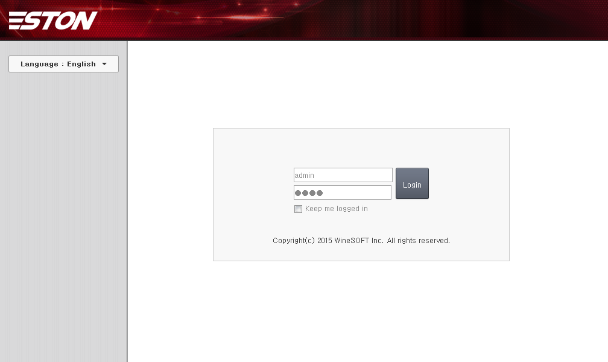
   
   WM Start Page
   

Account
====================================

The default account is set to [ID: **admin**, Password: **ston**]. If the login succeeds, the dashboard page will be displayed, showing the general status of STON.

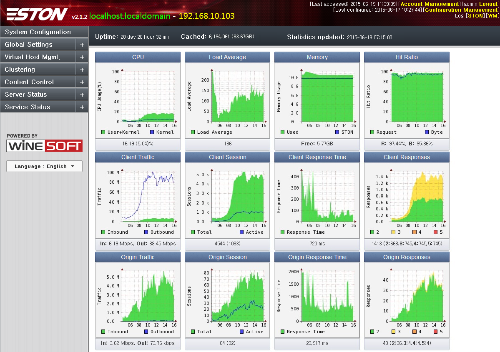
   
   WM Dashboard
   

.. _wm-update:

Update to Latest Version
====================================

When a new version is released, an "Update Available" message will be shown as seen below.

   
   A new update is available.
   
Clicking the message brings you to a page where you can update to the latest version. Depending on the status of the service, the safety level of performing the update will be shown.

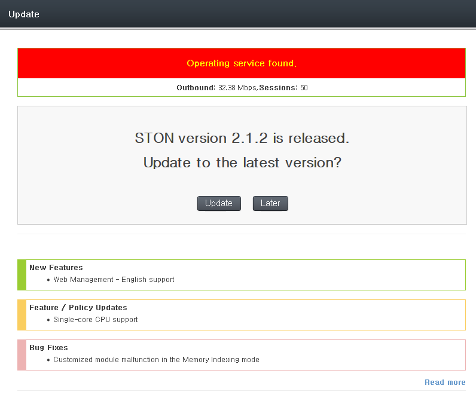
   
   WM Update could be dangerous.
   
When the update is completed, all services will automatically restart.

Menu Structure
====================================

Drop-down menus can be expanded/shrunk with mouse clicks.

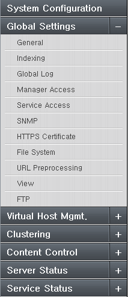
   
   WM Menu
   
1.  Global Settings
     All functions except for virtual host default settings can be configured in global settings (server.xml).

#.  Virtual Host Management
     You can add/suspend/delete virtual hosts and view the status of all virtual hosts in the service.
    
#.  Cluster
     You can create/manage/destruct clusters, and all services in a cluster can be viewed by servers and services.
    
#.  Content Control
     You can control the content in the service with functions such as Purge.
    
#.  Server Status
     You can monitor global settings such as the system status. All graphs use global resource graphs.
    
#.  Service Status
     You can monitor the service status of virtual hosts. All graphs use virtual host graphs.
    
#.  File System
     STON can be mounted on Linux VFS.
	

Global Settings
====================================

All functions except for virtual host default settings can be configured in global settings (server.xml).

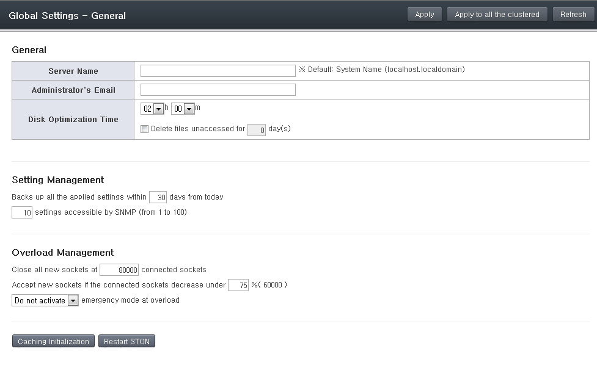
   
   WM Global Settings - General
   

Virtual Host Management
====================================

All virtual hosts in the service can be configured in detail, and new virtual hosts can be added. All virtual hosts that aren't configured independently will use the settings of the default virtual host (VHostDefault). This concept is identical to inheritance on object-oriented programming. The virtual hosts can override most parameters.

New
---------------------

Creates a new virtual host for the service. If a cluster is configured, then multiple virtual hosts can be created in every server at the same time. All virtual hosts will inherit from the default virtual host (VHostDefault), so a virtual host can be ready to enter the service after only setting its name and origin server address. There are eight different sub-options that can be expanded with the **Expand** button to show more detailed settings.

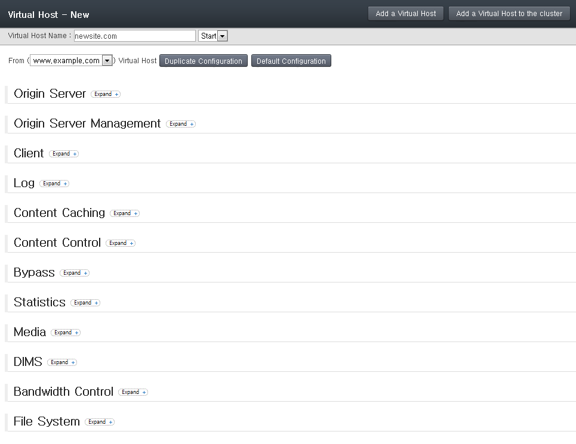
   
   WM Virtual Host Management - New
   
   
List
---------------------

You can monitor the status of all virtual hosts that are a part of the service. You can also start/stop each virtual host. If a cluster is configured, you can control the virtual hosts of all servers at the same time. The default virtual host can also be selected.

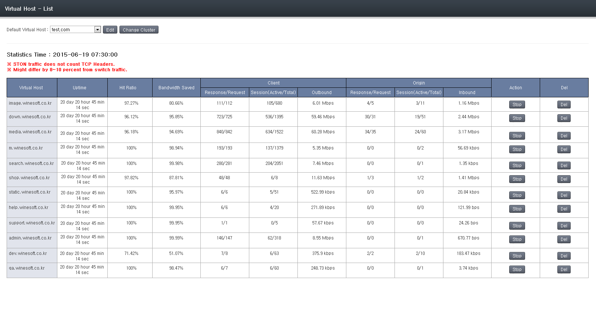
   
   WM Virtual Host Management - List
   
   
Detailed Configuration
----------------------

Here you can configure the default virtual host (VHostDefault) or individual virtual hosts. A virtual host can be selected after selecting the combo box in the upper left corner. **"Default Virtual Host"** is the default configurations that all virtual hosts will inherit. Therefore, any configurations that do not override this will be affected by changes to the "Default Virtual Host".

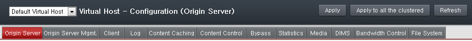
   
   WM Virtual Host Configuration - Top Menu
   
As in the above figure, there are many submenus, with the selected submenu colored red. Clicking on each menu will load a detailed configuration page, as shown in the figure below. All configurations will be reflected after "Apply" or "Apply to All Clusters" is clicked.

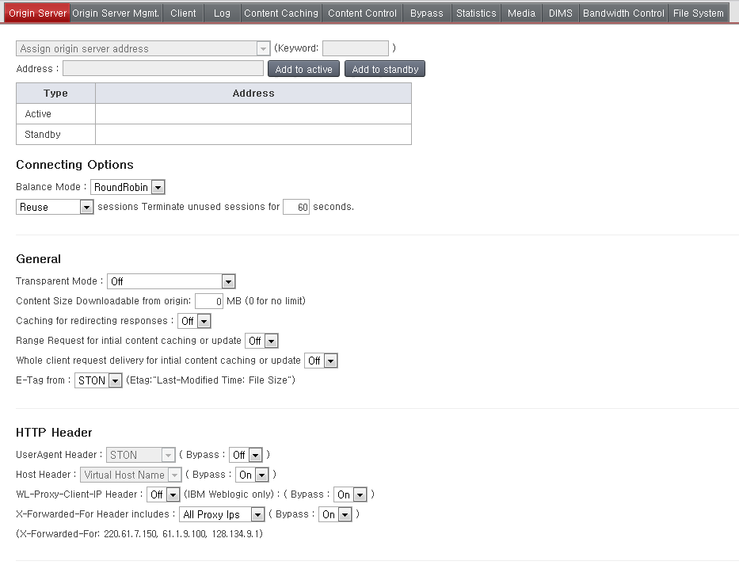
   
   WM Virtual Host Configuration - Origin Server

Almost all items in this section can be overridden, so you should have a through understanding of how it works. For example, if the TTL value of the default virtual host is set to 60, all virtual hosts will inherit this value. However, if this value is overridden, the corresponding virtual host will use the overridden TTL value.

.. figure:: img/wm_vhost_conf_sub_ttl.png
   :align: center
   
The three possibilities are explained below.

-  Override with another value
    While the default TTL is 60, the service for User A will use the overridden value of 180. This will not be affected by any changes to the default virtual host.
   
-  Override with the same value
    Though the values are the same, this will be processed as an override and the service for User B will use the overridden value of 60. However, even if the default virtual host's TTL is changed to 30, this will not affect User B's overridden setting of 60.
   
-  Do not override
    If a specific value is omitted, the service for User C will use the default value of 60. If the default virtual host's TTL is changed to 30, the TTL used for User C will also change to 30.

In WM, colors are used to identify overrides. A white background identifies inheritance of the default virtual host configuration. Overridden values use an apricot background to distinguish it from default values. All override settings have an X button on the right, which will remove the override when clicked.
   
   

Cluster
====================================

Multiple instances of STON can be merged into one cluster for integrated management/operation. All instances of STON are configured to have equal authority, so logging into any instance in the cluster will allow you to manage the entire cluster.

Structure
---------------------

A cluster can be created, or a server can be added to an existing cluster. Adding to a cluster requires authentication for the WM account. If WM is configured with identical account information (ID and password), the authentication procedure is skipped.

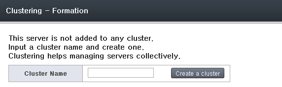
   
   Creating a new cluster.
   
   
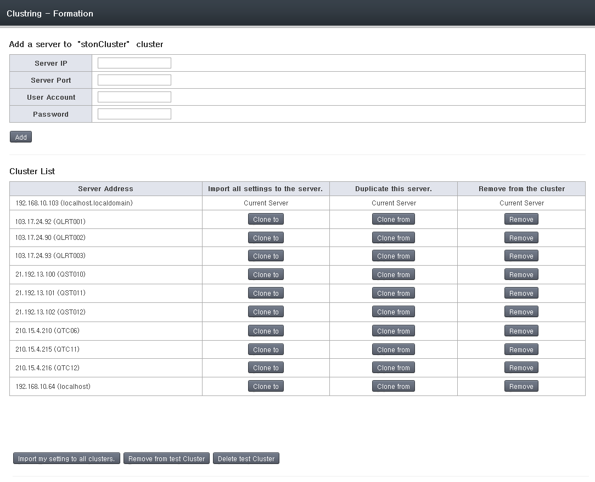
   
   Cluster list.
   
When a cluster is set up, the "Apply to All Clusters" button can be used when managing virtual hosts to configure multiple hosts at the same time. In addition, you can duplicate and apply configurations from one server to another in the same server. If you want to put a server into a different cluster, it must be removed and reconfigured.

Cluster Port
---------------------

When first configured, WM will use the same port as the cluster. Though it has the benefit of allowing clustering with only the WM account, this can pose problems in the restriction of access IPs.

* For security purposes, WM places a restriction so that only designated IPs can access it.
* All servers must specifically allow the IPs of the other servers to allow clustering.
* If there are too many servers or the server IPs are dynamic, it would be virtually impossible to properly fill out the IP list.

This problem can be resolved by using a separate port for clustering. Servers can then recognize each other not with a license file separate from the WM account. Clusters will only be possible between servers with the same license, which increases security.

**1. [Apache server] httpd.conf Multi-port configuration**

(For default installation) Open /usr/local/ston/wm/conf/httpd.conf and add ports as shown below.

.. figure:: img/wm_cluster_multiport.png
   :align: center

After saving, restart the Apache server to put the changes into effect.

**2. [WM] Clustering**

If multi-port configuration was successful, the "Allocate Clustering Port" button can be found.

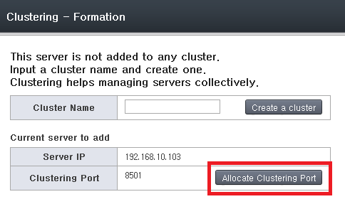

Click the button.

**3. [WM] Cluster Port Selection**

A list of ports that can be used will be shown. Select a port to configure.

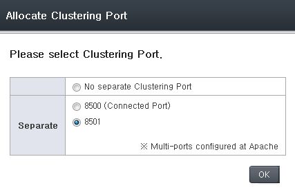

All servers in the same cluster must use the same port.

Server Status
---------------------

The status and service condition of all STON servers in a cluster can be checked. You can click on each item in the server list to view detailed information.

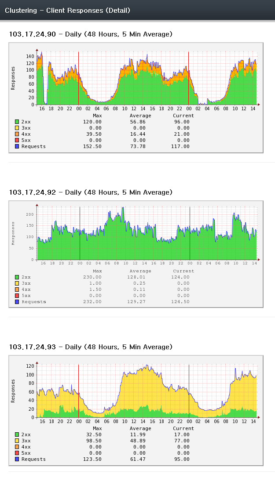
   
   Status for each server.
   
   
Virtual Host Status
---------------------

The MRTG of all virtual hosts in the cluster can be put together in one screen and checked. The virtual hosts can all be started/stopped at the same time. You can click on each item in the virtual host list to view detailed information.

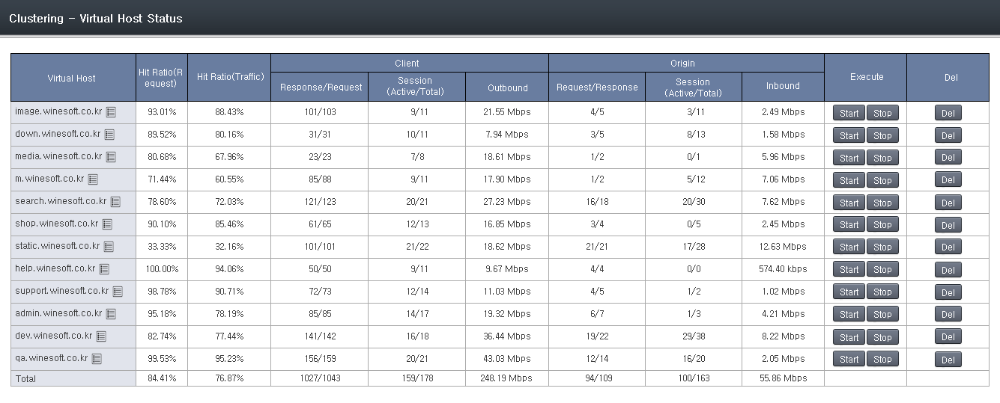
   
   Status for each virtual host.
   
   
Content Control
====================================

You can browse/control content currently in the service or perform cleanup. If a cluster is configured, content in all of the servers can be browsed or controlled at the same time.

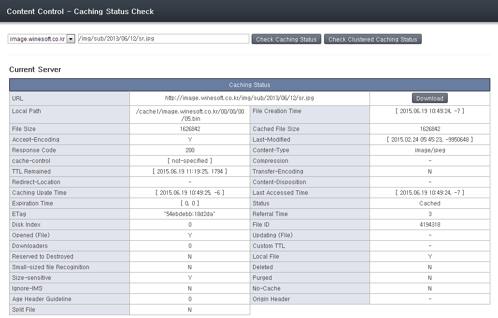
   
   Caching status check
   
   
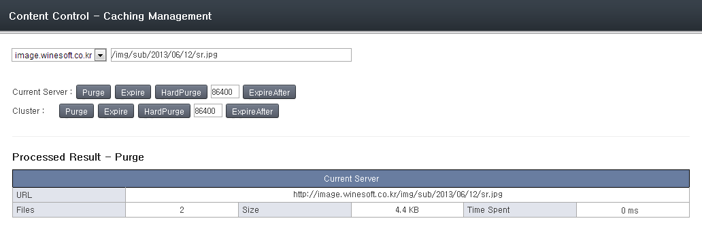
   
   API call (e.g. Purge)
   
      
System Information
====================================

You can look into the system information of the server in operation.

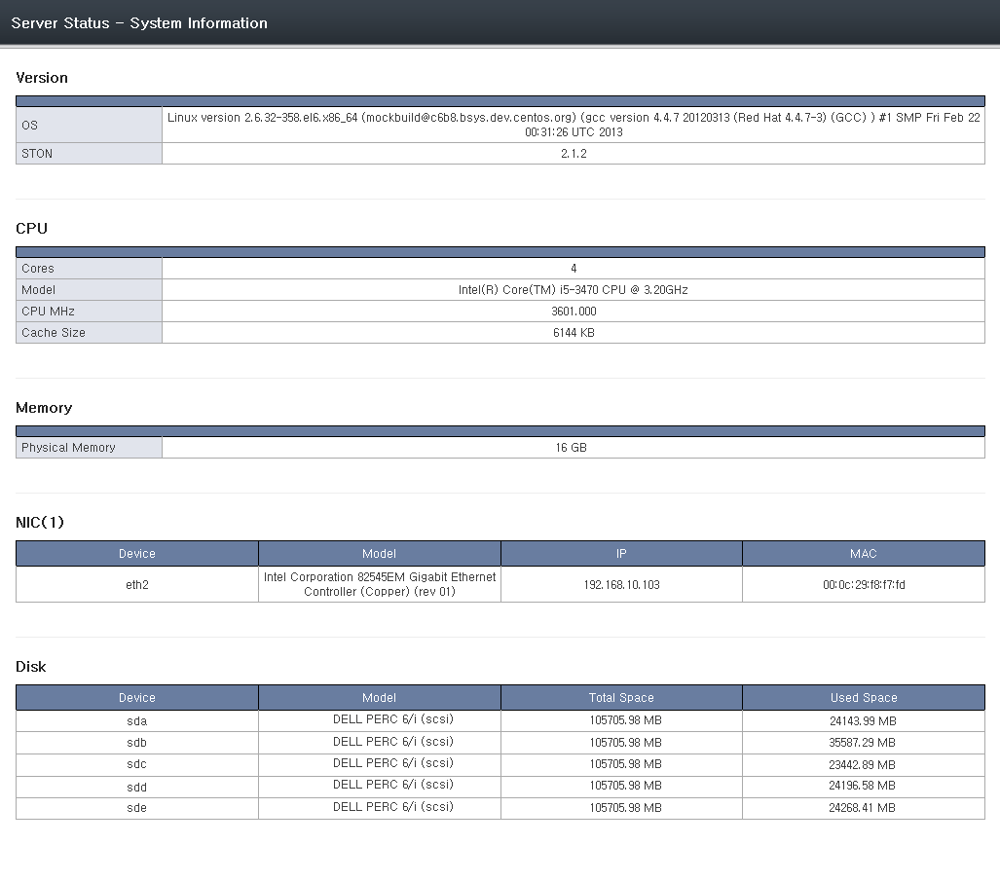

   
   
Service Status
====================================

You can monitor the service status of each virtual host.

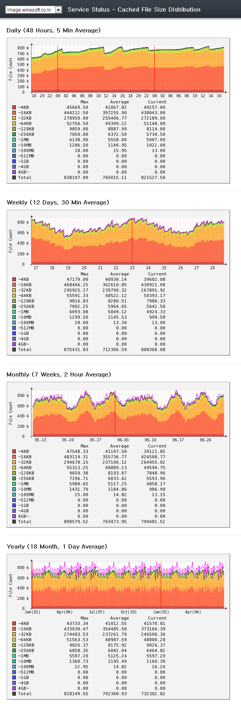
   
   Service status of virtual host.
   
